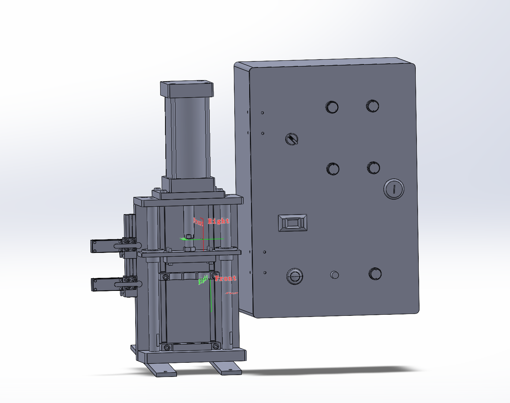

# 2025-015-弹簧测试机械

> 液压与气动 PLC 综合实训装置，面向机电、自动化专业教学实操设备，用于电 - 气 - 液 - 机械联动 PLC 编程实训教学

## 项目效果图

## 项目内容

1. **项目定位**
本设备为宁波工程学院机器人学院自研实训设备，是机电、自动化专业入门实操训练平台，依托三菱 PLC 实现气动 / 液压部件动作控制，直观展示电、气、液、机械一体化联动逻辑，作为工业自动化课程配套实践教具。
2. **硬件组成**

- 操作控制面板：急停按钮、上升 / 下降 / 启动 / 停止功能按键、手动 / 自动模式旋钮、电源开关、24V 开关电源；
- 控制核心：三菱 PLC 控制器，负责存储、执行控制逻辑程序；
- 配套电气元件：继电器、端子排、行程传感器、电磁阀执行机构；
- 配套气动液压执行单元：升降气缸、液压气动管路组件。

3. **控制系统说明**

- 硬件接线：外部按钮、急停、行程传感器信号接入 PLC 输入端子，PLC 输出驱动继电器控制气缸升降执行动作；
- 控制逻辑：包含手动单步控制、自动循环升降两套模式，搭配上下限位行程开关实现气缸限位保护；
- 配套资料：完整电气原理图、I/O 梯形图程序、端子接线对照表、整机装配实物图。

4. **实训教学功能**

- 基础实操：电气线路接线、气动液压回路搭建、PLC 硬件接线规范练习；
- 编程实训：三菱梯形图逻辑编写、手动 / 自动模式切换控制、限位互锁程序设计；
- 综合训练：电 - 气联动系统联调、设备故障排查、整机自动化流程调试；
- 课程价值：打通自动化理论与工程实操，掌握元件装配、程序设计、系统联调完整工程流程。

5. **配套文档资源**

- 《液压与气动 PLC 综合实训装置说明书.docx》：整机结构、部件功能、操作规范、实训总结；
- 电气图纸：主回路电气原理图、PLC 控制梯形图、I/O 端子接线对照表；
- 实物素材：控制面板、箱内 PLC 布线、元器件装配实拍图。

## 保留内容
- 本模板项目介绍：此为最初的准备的项目模板
    每个分支项目都会由他去继承
- 作者：Pinavia - 2025

